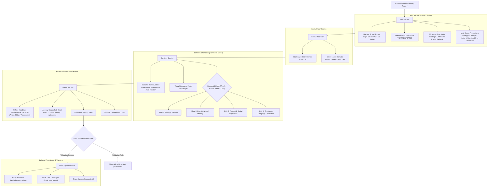
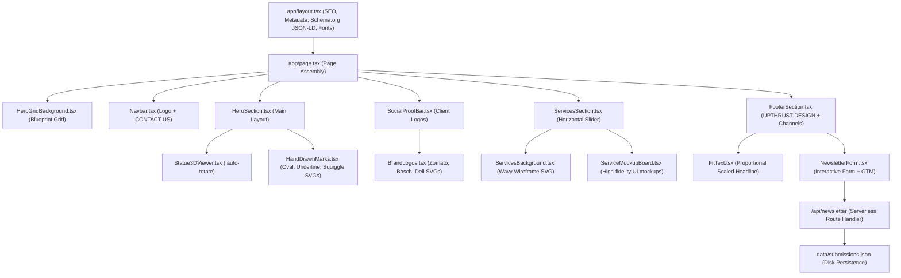
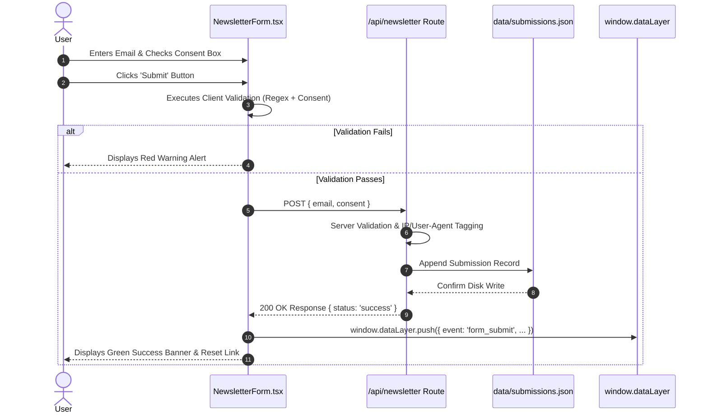
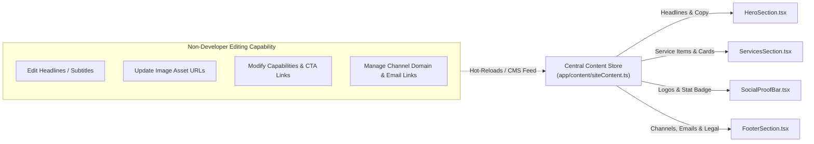

# Upthrust Landing Page — Webflow & Architecture Diagram

This document illustrates the complete user workflow, component hierarchy, data flow, and state transitions of the Upthrust landing page project.

---

## 1. Complete User & Page Navigation Workflow

---

## 2. Component Hierarchy & System Architecture

---

## 3. Form Submission & Conversion Tracking Flow

---

## 4. CMS Content Data Flow (`siteContent.ts`)

---

## 5. Responsive Breakpoint Layout Strategy

| Screen Breakpoint | Target Device | Key Responsive Adaptations |
| :--- | :--- | :--- |
| **`< 768px`** | Mobile (375px) | <ul><li>Single-column vertical stacking</li><li>Touch-swipe horizontal Services slider</li><li>Compact 90px "THAT" SVG and 10px note typography</li><li>FitText scales text down smoothly to 32px</li></ul> |
| **`768px - 1024px`** | Tablet (768px) | <ul><li>Side-by-side split cards for Services (`md:w-[46%]`)</li><li>2-column Footer channels grid (`sm:grid-cols-2`)</li><li>Intermediate font scaling for hero annotations</li></ul> |
| **`>= 1024px`** | Desktop (1440px) | <ul><li>Max 1440px container alignment (`max-w-[1440px] mx-auto`)</li><li>Full 12-column Footer layout (`lg:grid-cols-12`) with 61.6% left / 38.4% right split</li><li>Full 200px Anton typography for **UPTHRUST DESIGN**</li><li>Interactive mouse wheel horizontal slide scrolling</li></ul> |

---

## 6. Verification & Interview Checklist

- [x] **Live Webflow Verification:** Open `http://localhost:3000` to interact with the complete flow.
- [x] **Live Data Persistence:** Inspect `data/submissions.json` or visit `http://localhost:3000/api/newsletter`.
- [x] **GTM Event Verification:** Open DevTools Console and inspect `window.dataLayer`.
- [x] **3D Rotation Verification:** Statue and 3D curve line background auto-rotate smoothly in real-time.
